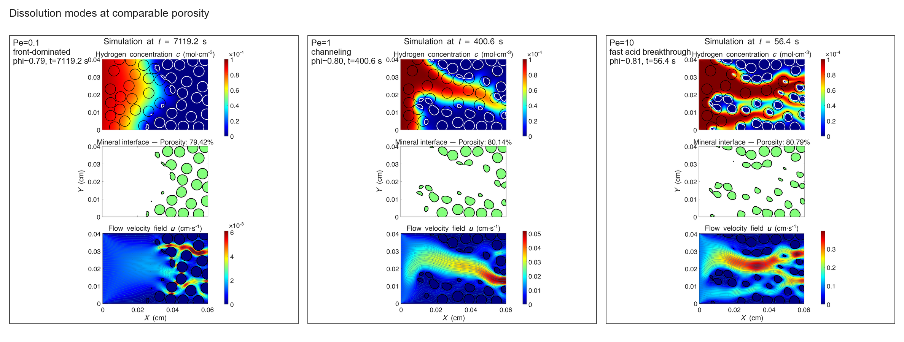
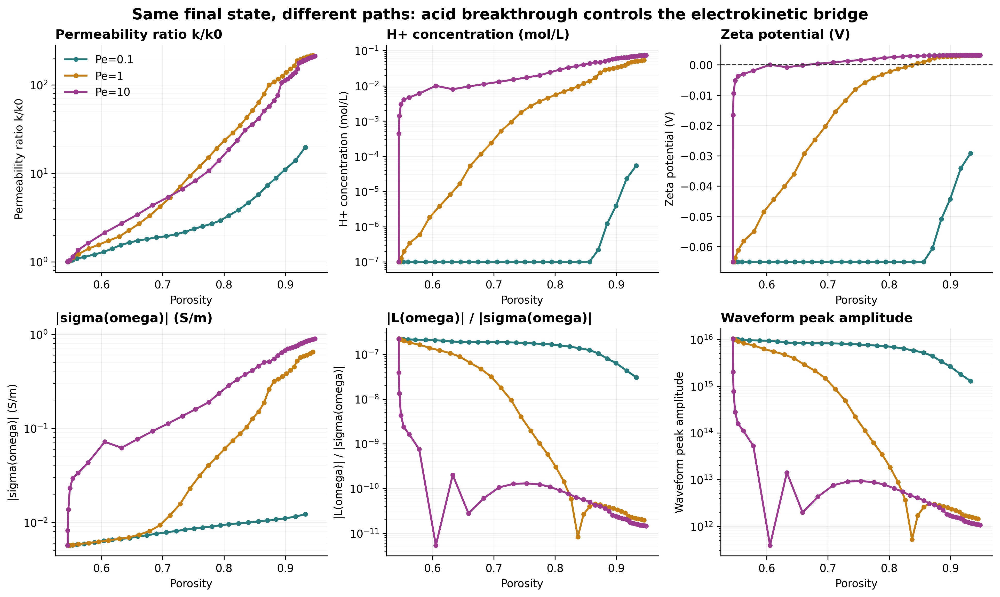
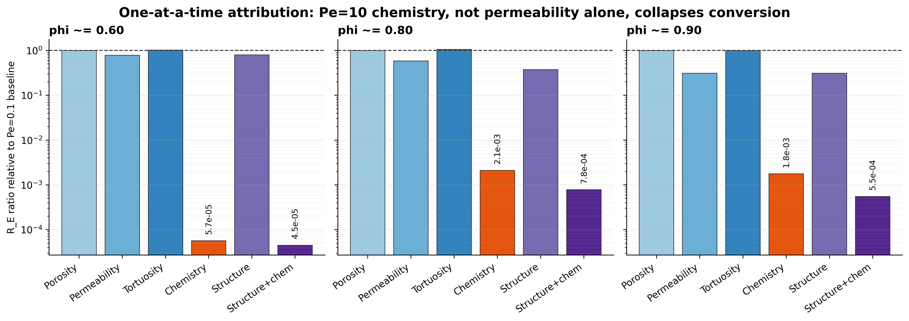
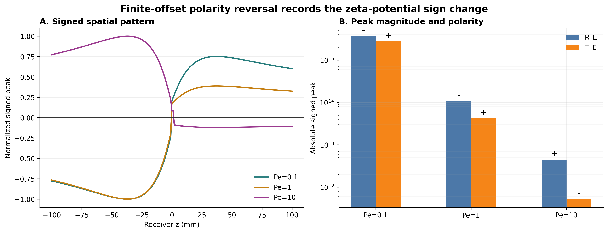
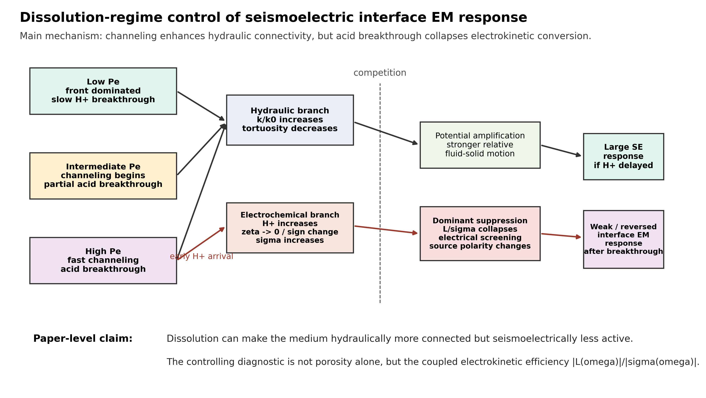

# Results and Discussion Draft: Pe-Controlled Dissolution Regimes and Seismoelectric Interface Response

This draft converts the mechanism analysis into manuscript-style Results and Discussion text. It uses the generated figures in `paper_figure_sequence_analysis/pe_mode_mechanism/` and cites the literature that supports each step of the mechanism chain.

## Results

### Pe Controls the Dissolution Pathway Rather Than the Final Dissolved State

The three reactive-transport simulations reached nearly the same end state, with porosity approaching 1.0, permeability increasing to about 248 times the initial value, and tortuosity approaching 1.0. However, the pathways by which these end states were reached differed strongly with Pe. This path dependence matters because the seismoelectric model responds to the transient combination of hydraulic connectivity and pore-fluid chemistry, not only to final porosity or final permeability.

**Figure 1.** Dissolution modes at comparable porosity. The panels compare Pe=0.1, Pe=1, and Pe=10 at porosity close to 0.8. Low Pe retains a front-dominated H+ distribution, whereas Pe=1 and Pe=10 develop channelized H+ transport and focused velocity pathways.

At comparable porosity near 0.8, Pe=0.1 retained a broad reaction-front geometry, whereas Pe=1 and Pe=10 developed more connected high-H+ and high-velocity pathways (Figure 1). This behavior is consistent with the established view that transport and reaction rates control compact dissolution, uniform dissolution, and channelized or wormhole-like dissolution in carbonate media (Fredd & Fogler, 1999; Panga et al., 2005; Szymczak & Ladd, 2009; Soulaine et al., 2017). The present simulations further show that this morphological divergence is not only a hydrological outcome. It becomes the upstream control on the electrochemical state that enters the seismoelectric interface problem.

### Channeling Accelerates Acid Breakthrough and Reshapes the Electrokinetic Bridge

The parameter trajectories show why permeability alone cannot explain the seismoelectric response. Pe=1 and Pe=10 enter high-permeability states earlier than Pe=0.1, consistent with previous observations that carbonate dissolution can produce a nonlinear increase in permeability through changes in pore geometry and connectivity (Noiriel et al., 2004; Menke et al., 2015; Pereira Nunes et al., 2016). However, the largest separation among the three cases occurs in the electrochemical variables. In the high-Pe case, H+ concentration increases early, zeta potential approaches zero and then becomes positive, dynamic conductivity increases, and the ratio `|L(omega)|/|sigma(omega)|` collapses (Figure 2).

**Figure 2.** Same final state, different paths. The panels compare permeability ratio, H+ concentration, zeta potential, dynamic conductivity, electrokinetic efficiency `|L(omega)|/|sigma(omega)|`, and waveform peak amplitude as functions of porosity for the three Pe cases.

The comparison at porosity near 0.75 provides a compact quantitative example. Pe=0.1 has `cH=1.0e-7 mol/L`, `zeta=-0.065 V`, `|sigma|=8.57e-3 S/m`, and `|L|/|sigma|=1.78e-7`. Under similar porosity, Pe=10 has `cH=1.74e-2 mol/L`, `zeta=1.60e-3 V`, `|sigma|=1.59e-1 S/m`, and `|L|/|sigma|=1.30e-10`. The corresponding waveform peak decreases from `7.81e15` to `9.30e12`. Thus, the high-Pe case is hydraulically more connected but electrokinetically less efficient. This behavior is consistent with electrokinetic theory, in which streaming-current coupling depends on zeta potential, pore geometry, permeability, and fluid conductivity (Jouniaux & Pozzi, 1995; Pride, 1994; Soldi et al., 2024). It is also consistent with carbonate experiments showing that reactive alteration can change electrical conductivity and streaming-potential coupling through changes in pore-fluid chemistry (Cherubini et al., 2019).

### Parameter Substitution Identifies Chemistry as the Dominant Driver of Conversion Collapse

To separate structural and electrochemical effects, we performed one-at-a-time substitutions at fixed porosity, using the Pe=0.1 state as the baseline and replacing selected variables with their Pe=10 values. This test directly evaluates whether the large response difference is controlled by porosity, permeability, tortuosity, or H+-controlled chemistry.

**Figure 3.** One-at-a-time attribution of the Pe=10 response relative to the Pe=0.1 baseline. At each porosity, structural variables and H+-controlled electrochemistry were substituted separately. The chemistry substitution produces the strongest collapse in `R_E`.

The attribution result is strongest at porosity near 0.60. Replacing only porosity changes `R_E` by less than 1%, and replacing tortuosity produces only a small increase. Replacing permeability by the Pe=10 value reduces `R_E` to 0.78 of the Pe=0.1 baseline, whereas replacing only the H+-controlled chemistry reduces `R_E` to `5.7e-5` of the baseline. Replacing all structural variables without chemistry leaves `R_E` at 0.80 of the baseline, while replacing structure and chemistry together reduces it to `4.5e-5`. This comparison indicates that channeling is the transport mechanism that delivers acid early, but the dominant model driver of seismoelectric conversion collapse is the electrochemical state produced by acid breakthrough.

This distinction is important for interpreting dissolution-driven seismoelectric signals. A permeability increase can enhance relative fluid-solid motion and change dynamic permeability, but the same channelized pathways can increase ionic strength and reduce the effective electrokinetic source. In these simulations, the electrochemical suppression dominates over the hydraulic amplification. The controlling diagnostic is therefore better expressed by `|L(omega)|/|sigma(omega)|` than by porosity or permeability alone.

### The High-Pe Case Shows Polarity Reversal Linked to Zeta-Potential Sign Change

The finite-offset spatial response provides an independent test of the same mechanism. Pe=0.1 and Pe=1 preserve the same reflected and transmitted signed-peak pattern, whereas Pe=10 reverses the dominant signed peaks across the interface (Figure 4). This reversal occurs when the modeled zeta potential has changed sign. The result indicates that the interface EM response records not only the weakening of electrokinetic conversion but also a change in source polarity.

**Figure 4.** Finite-offset polarity reversal. Pe=0.1 and Pe=1 preserve a similar signed spatial pattern, whereas Pe=10 shows a reversed dominant polarity. The reversal is consistent with the zeta-potential sign change inferred from the H+-controlled electrochemical model.

This behavior is consistent with the structure of the Pride and Schakel formulations, in which electrokinetic coupling enters the coupled electromagnetic and poroelastic boundary-value problem through dynamic coupling coefficients and conductivity (Pride, 1994; Schakel & Smeulders, 2010). It also aligns with finite-offset VSEP theory, where the interface EM waveform and spatial polarity depend on the sign and magnitude of the conversion coefficients and on receiver geometry (Liu et al., 2018). The sign reversal in Figure 4 therefore supports the interpretation that Pe=10 does not merely attenuate the response by changing geometry. It changes the effective polarity of the electrokinetic source.

## Discussion

### A Competition Between Hydraulic Amplification and Electrochemical Screening

The results support a two-branch mechanism for dissolution-controlled seismoelectric response (Figure 5). In the hydraulic branch, dissolution increases permeability and reduces tortuosity, which can increase relative fluid-solid motion and alter dynamic permeability. In the electrochemical branch, channelized acid transport increases H+ concentration, drives zeta potential toward zero or sign reversal, and increases dynamic conductivity. The first branch can amplify seismoelectric conversion, but the second branch can suppress it by reducing the available electrokinetic coupling and increasing electrical screening.

**Figure 5.** Conceptual mechanism linking dissolution regime to seismoelectric interface response. Channeling enhances hydraulic connectivity, but acid breakthrough collapses electrokinetic conversion by changing zeta potential and conductivity.

In the present simulations, the electrochemical branch dominates. This explains the apparently counterintuitive result that the high-Pe case becomes hydraulically more connected but seismoelectrically less active. The effect is not a generic consequence of increasing Pe alone. It arises because the Pe=10 dissolution pathway creates early acid breakthrough, which shifts the medium from an electrokinetically active state to a high-conductivity, weak-coupling state.

### Relation to Previous Seismoelectric and Reactive-Transport Work

Previous seismoelectric studies have shown that interface-generated EM responses depend on porosity, permeability, fluid salinity or conductivity, viscosity, and electrokinetic coupling (Pride, 1994; Garambois & Dietrich, 2002; Schakel & Smeulders, 2010; Liu et al., 2018). Reactive-transport and carbonate-dissolution studies have independently shown that dissolution regime controls pore geometry, permeability, tortuosity, and solute breakthrough (Noiriel et al., 2004; Szymczak & Ladd, 2009; Menke et al., 2015; Soulaine et al., 2017; Menke et al., 2023). The present analysis connects these two lines of work by showing how a dissolution pathway can alter the dynamic electrokinetic bridge before the interface EM waveform is generated.

This connection shifts the interpretation of seismoelectric monitoring from a static property-contrast problem to a path-dependent reactive-transport problem. Under delayed acid breakthrough, the medium can remain electrokinetically active even as porosity increases. Under fast channelized breakthrough, the same increase in hydraulic connectivity can suppress the interface response. This path dependence may explain why porosity or permeability alone is insufficient as a predictor of seismoelectric amplitude during reactive alteration.

### Implications and Model Limitations

The most useful diagnostic emerging from these simulations is `|L(omega)|/|sigma(omega)|`. This ratio combines the dynamic electrokinetic coupling available for conversion with the dynamic conductivity that promotes electrical screening. It tracks the waveform peak more directly than porosity or permeability in the Pe comparison and provides a physically interpretable bridge between reactive-transport outputs and seismoelectric observables.

Several limits should be kept explicit. First, the conversion from outlet H+ concentration to electrolyte concentration, conductivity, and zeta potential is a simplified electrochemical mapping. A full carbonate system would include Ca2+, bicarbonate, carbonate speciation, CO2 equilibrium, and surface complexation. Second, the main interpretation should focus on the interval with `valid_poroelastic=True`, because the poroelastic framework becomes questionable once porosity approaches the fully dissolved limit. Third, the current interface model uses effective medium properties rather than explicitly resolving the local two-dimensional channel geometry in the Schakel boundary conditions. These limits do not remove the internal consistency of the model result, but they define the next tests needed to strengthen the interpretation.

### Main Takeaway

The key result is that dissolution can increase hydraulic connectivity while reducing seismoelectric activity. In these simulations, high-Pe channeling accelerates acid breakthrough, which drives zeta potential toward zero or sign reversal and increases dynamic conductivity. The resulting collapse of `|L(omega)|/|sigma(omega)|` suppresses the interface EM response and can reverse its finite-offset polarity. The seismoelectric response therefore carries information about the reactive pathway, not only about final porosity or permeability.

## References Used in the Text

- Cherubini, A., Garcia, B., Cerepi, A., & Revil, A. (2019). Influence of CO2 on the electrical conductivity and streaming potential of carbonate rocks. *Journal of Geophysical Research: Solid Earth*. https://doi.org/10.1029/2018JB017057
- Fredd, C. N., & Fogler, H. S. (1999). Optimum conditions for wormhole formation in carbonate porous media: Influence of transport and reaction. *SPE Journal*. https://doi.org/10.2118/56995-PA
- Garambois, S., & Dietrich, M. (2002). Full waveform numerical simulations of seismoelectromagnetic wave conversions in fluid-saturated stratified porous media. *Journal of Geophysical Research: Solid Earth*. https://doi.org/10.1029/2001JB000316
- Jouniaux, L., & Pozzi, J. P. (1995). Permeability dependence of streaming potential in rocks for various fluid conductivities. *Geophysical Research Letters*. https://doi.org/10.1029/94GL03307
- Liu, Y., Smeulders, D., Su, Y., & Tang, X. (2018). Seismoelectric interface electromagnetic wave characteristics for the finite offset Vertical Seismoelectric Profiling configuration: Theoretical modeling and experiment verification. *Journal of the Acoustical Society of America*. https://doi.org/10.1121/1.5020261
- Menke, H. P., Bijeljic, B., Andrew, M. G., & Blunt, M. J. (2015). Dynamic three-dimensional pore-scale imaging of reaction in a carbonate at reservoir conditions. *Environmental Science & Technology*. https://doi.org/10.1021/es505789f
- Menke, H. P., Maes, J., & Geiger, S. (2023). Channeling is a distinct class of dissolution in complex porous media. *Scientific Reports*. https://doi.org/10.1038/s41598-023-37725-6
- Noiriel, C., Gouze, P., & Bernard, D. (2004). Investigation of porosity and permeability effects from microstructure changes during limestone dissolution. *Geophysical Research Letters*. https://doi.org/10.1029/2004GL021572
- Panga, M. K. R., Ziauddin, M., & Balakotaiah, V. (2005). Two-scale continuum model for simulation of wormholes in carbonate acidization. *AIChE Journal*. https://doi.org/10.1002/aic.10574
- Pereira Nunes, J. P., Blunt, M. J., & Bijeljic, B. (2016). Pore-scale simulation of carbonate dissolution in micro-CT images. *Journal of Geophysical Research: Solid Earth*. https://doi.org/10.1002/2015JB012117
- Pride, S. R. (1994). Governing equations for the coupled electromagnetics and acoustics of porous media. *Physical Review B*. https://doi.org/10.1103/PhysRevB.50.15678
- Schakel, M. D., & Smeulders, D. M. J. (2010). Seismoelectric reflection and transmission at a fluid/porous-medium interface. *Journal of the Acoustical Society of America*. https://doi.org/10.1121/1.3263613
- Soldi, M., Guarracino, L., & Jougnot, D. (2024). Predicting streaming potential in reactive media: The role of pore geometry during dissolution and precipitation. *Geophysical Journal International*. https://doi.org/10.1093/gji/ggad457
- Soulaine, C., Roman, S., Kovscek, A., & Tchelepi, H. A. (2017). Mineral dissolution and wormholing from pore-scale simulations. *Journal of Fluid Mechanics*. https://doi.org/10.1017/jfm.2017.499
- Szymczak, P., & Ladd, A. J. C. (2009). Wormhole formation in dissolving fractures. *Journal of Geophysical Research: Solid Earth*. https://doi.org/10.1029/2008JB006122
